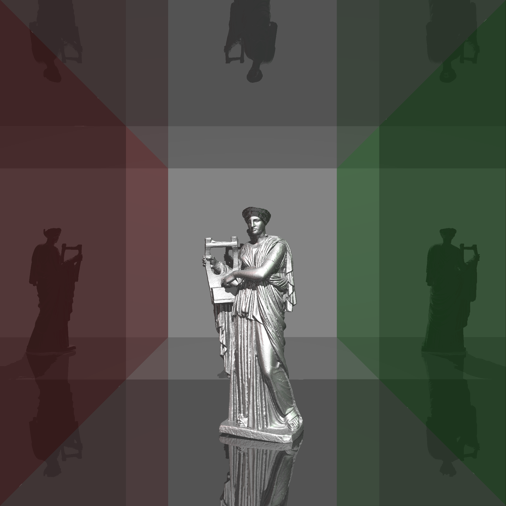

  

# References

1. [Computer Graphics from Scratch](https://gabrielgambetta.com/computer-graphics-from-scratch/)
2. [Scratchapixel 3.0](https://www.scratchapixel.com/)
3. [How to build a BVH – Part 1: Basics](https://jacco.ompf2.com/2022/04/13/how-to-build-a-bvh-part-1-basics/)
4. [How to build a BVH – part 2: Faster Rays](https://jacco.ompf2.com/2022/04/18/how-to-build-a-bvh-part-2-faster-rays/)
5. [How to build a BVH – part 3: Quick Builds](https://jacco.ompf2.com/2022/04/21/how-to-build-a-bvh-part-3-quick-builds/)
6. [Computer Graphics Archive](https://casual-effects.com/data)
7. [Marcus Aurelius](https://sketchfab.com/3d-models/marcus-aurelius-36fd581851294110a7eda08ec2a20748)
8. [GNU gprof](https://ftp.gnu.org/old-gnu/Manuals/gprof-2.9.1/html_mono/gprof.html)
